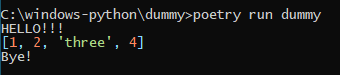
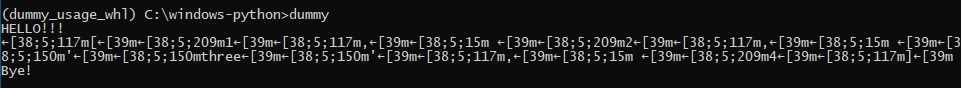

# Poetry vs pip behavior

## Poetry behavior


## Pip behavior


# Steps to reproduce

## Clone this repo

```bat
mkdir C:\windows-python
cd C:\windows-python
git clone https://github.com/ericfrederich/dummy.git
```

# Run from source
```bat
cd C:\windows-python\dummy
poetry install
poetry run dummy
```

# Run from pip installation

```bat
REM Build the dist files
cd C:\windows-python\dummy
poetry build
REM Install into a new venv
cd C:\windows-python
py -3.10 -m venv dummy_usage_whl
dummy_usage_whl\Scripts\activate
python -m pip install --upgrade pip wheel
python -m pip install dummy\dist\dummy-0.1.0-py3-none-any.whl
dummy
```
